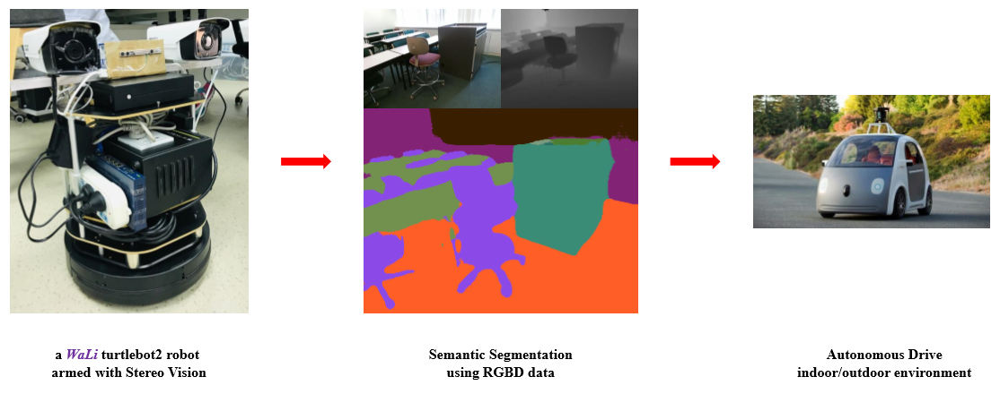
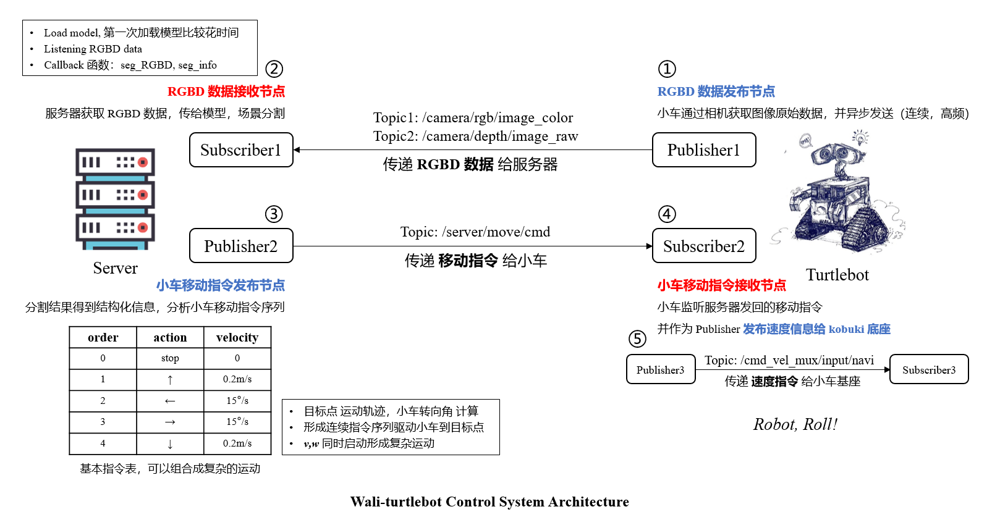
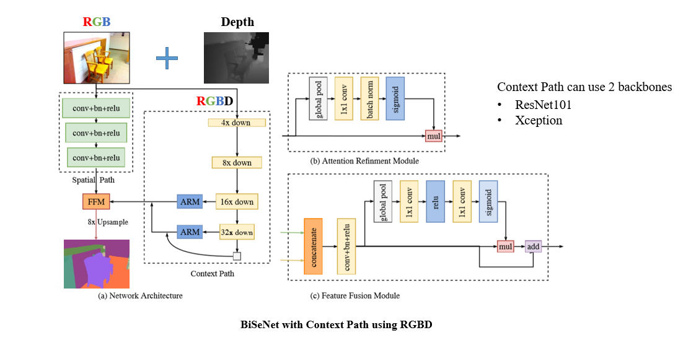
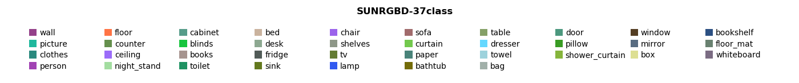
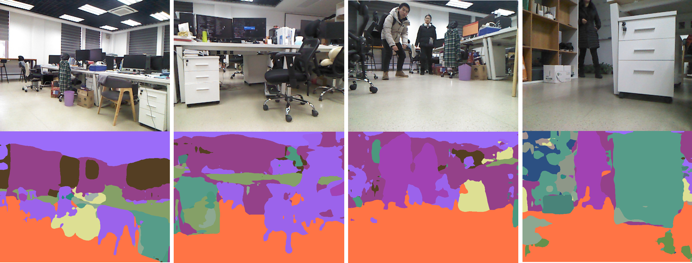
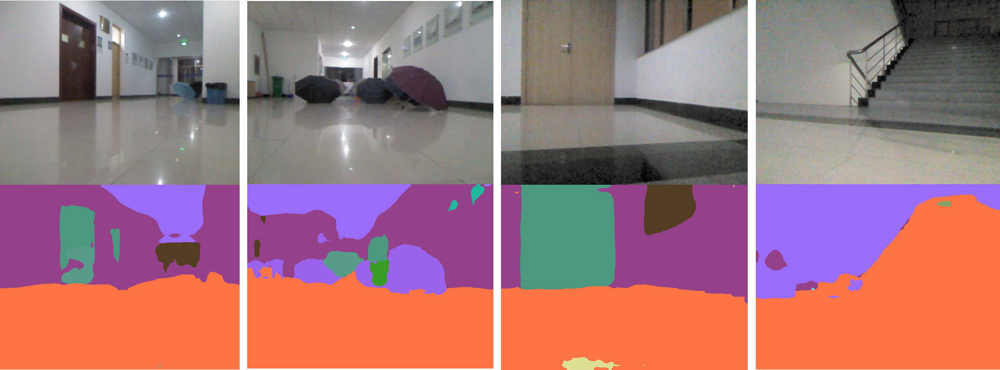

keep updating...

## [Wali_Detection - 2019.06.20](https://github.com/Shuai-Xie/Wali-turtlebot/tree/master/wali_Detection)

**Detection:**
- Wali 添加物体检测模块 `detect` 功能包，实现 **YOLOv3 80类**物体检测 (ros + python3.5)
- Demo: https://www.bilibili.com/video/av56205873/


**RGBD Segmentation: Stereo vs Kinect**
- 参考 [Dilated Residual Networks](https://github.com/fyu/drn) 结构，解决 Deconv 上采样锯齿问题
- 实时获取双目相机 RGBD 数据场景分割，Demo: https://www.bilibili.com/video/av56205677
- 训练 RGB 和 RGBD 场景分割模型，共 3 组输入尺寸：240x320, 320x480, 480x640, 总共 6 个模型
- Stereo vs Kinect 对比实验，图像输入尺寸: 240x320
  - RGBD Demo: https://www.bilibili.com/video/av56209791/
  - RGB Demo: https://www.bilibili.com/video/av56210542/


---

## [Wali_TX2 - 2019.05.11](https://github.com/Shuai-Xie/Wali-turtlebot/tree/master/wali_TX2)

部署 Wali_ROS_system 到 Jetson TX2，基于 **ROS + tb2 + tensorRT + kinect/stereo** 实时 RGBD 场景分割。
- 实时获取 Kinect/RealSense RGBD，自定义 `RGBD_Image.srv` 实现
- 实时获取 双目相机 Stereo RGBD，自定义 `RGBD_Image.msg` 实现
- 使用 tensorRT 构建 BiSeNet C++ 模型推理 engine
- 构建 RGBD 图像发布节点 (kinect, stereo)
- 构建 BiSeNet C++ 模型推理节点
- 实时获取 kinect RGBD 数据场景分割，Demo: https://www.bilibili.com/video/av51854928/


---

## [Wali_depth - 2019.02.20](https://github.com/Shuai-Xie/Wali-turtlebot/tree/master/wali_depth)

只利用相机 **Depth** 信息指导小车移动方向。

**1. 思路：**

```py
while True:
	Depth 中心模拟一个与小车同大小的 ROI;

	# 判断是否需要转弯
	if ROI_AVG_Depth > SAFE_MIN_DISTANCE:
		小车保持原来方向直走;

	else:
		缓慢减速, 小车停下;

		# begin search new direction
		Depth 横向模拟一组 ROI，计算 ROI_AVG_Depth_Max;

		if ROI_AVG_Depth_Max > SAFE_MIN_DISTANCE:
			选择 ROI_AVG_Depth_Max 对应的 ROI 中心作为前进方向;
			旋转小车直到 相机中心 与 ROI 中心重合;
	  		缓慢加速，小车重新启动;
	  	else:
	  		No way to Go!
	  		break
		# end search
```


**2. Road Test：**

① 未设置匀变速运动，速度突变卡顿
- indoor: https://www.bilibili.com/video/av44314807/

② 添加匀变速运动之后，卡顿问题解决
- in1：https://www.bilibili.com/video/av44315156/
- in2：https://www.bilibili.com/video/av44315266/
- out1：https://www.bilibili.com/video/av44315515/
- out2：https://www.bilibili.com/video/av44315582/

---

## Wali-turtlebot
Wali turtlebot is a self-driving turtlebot, using **Scene Segmentation** on **RGBD** data to make **Path Planning**.



### 1. Hardware
- Turtlebot2
- Jetson TX2
- HIKVISION wireless camera (stereo)
- Microsoft Kinect v1 (not intense, not outdoor)
- Intel RealSense R200
- HiSilicon970 (arm)

### 2. Wali ROS System Architecture
- ROS Nodes communication (Service, Topic)
- Turtlebot motion control using rospy (forward, left, right, back, and **smoothly speed up**)



### 3. BiSeNet-RGBD Architecture



BiSeNet-RGBD is trained on [Princeton SUN-RGBD dataset](http://rgbd.cs.princeton.edu/). Now it can predict 37 class, we'll annotate some specific classes in our practical scenario using labelme in the future. 



**Test scenes:**

- indoor



- outdoor



- stereo: https://www.bilibili.com/video/av44357263/