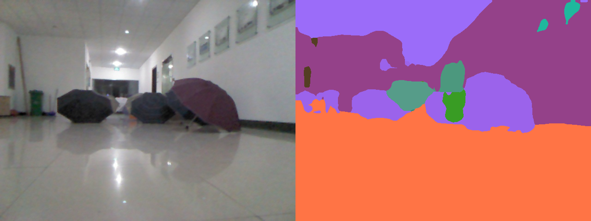

# Wali-turtlebot
Wali turtlebot is a self-driving turtlebot, which uses **Scene Segmentation** on **RGBD** data to make **Path Planning** for turtlebot. This process is shown in the following picture.

## 1. Hardware

The hardware device we use:
- Turtlebot2
- HIKVISION wireless camera (stereo)
- Microsoft Kinect v1
- HiSilicon970 (arm)
- others, little computer host, Intel RealSense R200

We use a kinect v1 to obtain RGB and Depth data now, in the future, we'll replace it with the stereo camera composed of two HIKVISION wireless cameras. 

There are 2 reasons why we use stereo rather than kinect. 
- kinect can't obtain intense depth image.
- kienct can't work well in outdoor environment.

The following picture shows the evolution process of Wali turtlebot.

## 2. Technology
The core technology we use:
- Bilateral Semantic Segmentation on RGBD data (BiSeNet-RGBD, 20fps on Nvidia Quadro P5000)
- ROS robot nodes communication mechanism
- Turtlebot motion control using rospy (forward, left, right, back, and **smoothly speed up**)
- Depth-based direction choose if not use the neural network（choose the direction with the largest depth）

### 2.1 BiSeNet-RGBD
BiSeNet-RGBD architecture is shown below.

BiSeNet-RGBD is trained on [Princeton SUN-RGBD dataset](http://rgbd.cs.princeton.edu/). Now it can predict 37 class, we'll annotate some specific classes in our practical scenario using labelme in the future. 

**Test scenes：**There are 10 scenes including 4 indoors and 6 outdoors, which are used to test model performance. The test results is list in part 3.

### 2.2 Wali turtlebot control system

By using this architecture, we've made some drive test in the real scenario.

The test video is shown in part 3.

## 3. Test results

### 3.1 BiSeNet-RGBD

- 4 indoor scenes

- 6 outdoor scenes

- stereo vision We also test out model on RGBD data obtained by stereo camera. The test results is shown in the video below.

### 3.2 Wali drive test

未设置匀变速运动，速度突变卡顿
- indoor: https://www.bilibili.com/video/av44314807/

添加匀变速运动之后，卡顿问题解决
- in1：https://www.bilibili.com/video/av44315156/
- in2：https://www.bilibili.com/video/av44315266/
- out1：https://www.bilibili.com/video/av44315515/
- out2：https://www.bilibili.com/video/av44315582/

updating...