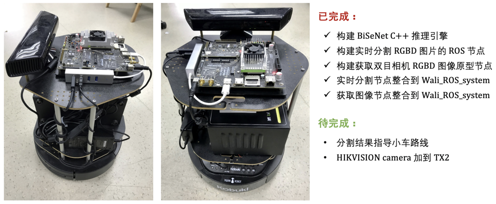

## Wali_TX2

基于 **Jetson TX2 + ROS + tb2 + tensorRT + kinect/stereo** 实时 RGBD 场景分割。
- 实时获取 Kinect/RealSense RGBD，自定义 `RGBD_Image.srv` 实现
- 实时获取 双目相机 Stereo RGBD，自定义 `RGBD_Image.msg` 实现
- 使用 tensorRT 构建 BiSeNet C++ 模型推理 engine
- 构建 RGBD 图像发布节点
- 构建 BiSeNet C++ 模型推理节点
- Demo 演示：https://www.bilibili.com/video/av51854928/




工程目录：
```sh
.
├── CMakeLists.txt -> /opt/ros/kinetic/share/catkin/cmake/toplevel.cmake
├── kinect
│   ├── CMakeLists.txt
│   ├── package.xml
│   ├── scripts
│   │   ├── kinect_rgbd_client.py  # kinect RGBD clinet, 订阅服务，并保存 RGBD 到本地
│   │   └── kinect_rgbd_server.py  # kinect RGBD server, 接收 /Camera/rgb/image_raw, /Camera/depth/image_raw 并发布
│   └── srv
│       └── RGBD_Image.srv  # 自定义 RGBD_Image.srv
├── model
│   ├── ckpts
│   │   └── bisenet.onnx  # pytroch 导出的 onnx 模型
│   ├── CMakeLists.txt
│   ├── package.xml
│   └── src
│       ├── common.h  # tensorRT 通用辅助头文件
│       └── kinect_bisenet.cpp  # tensorRT C++ 模型推理节点
└── stereo
    ├── CMakeLists.txt
    ├── img  # 测试的 RGBD 源文件
    │   ├── depth.png
    │   └── rgb.jpg
    ├── msg
    │   └── RGBD_Image.msg  # 自定义 RGBD_Image.msg
    ├── package.xml
    └── src
        ├── stereo_rgbd_puber.cpp  # 自定义 stereo RGBD image 发布节点
        └── stereo_rgbd_suber.cpp  # 自定义 stereo RGBD image 接收节点

```

运行：

```sh
# ros 启动 kinect RGBD stream
roslaunch freenect_launch freenect.launch

# 启动 kinect RGBD server
rosrun kinect kinect_rgbd_server.py

# 启动模型推理节点，实时接收 kinect RGBD 并分割
rosrun model kinect_bisenet
```